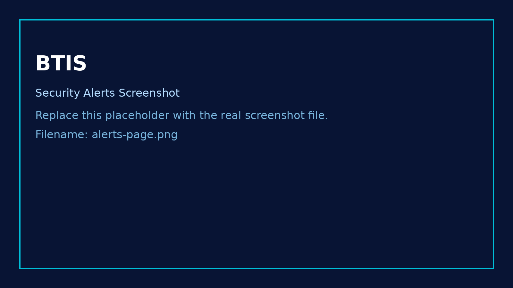
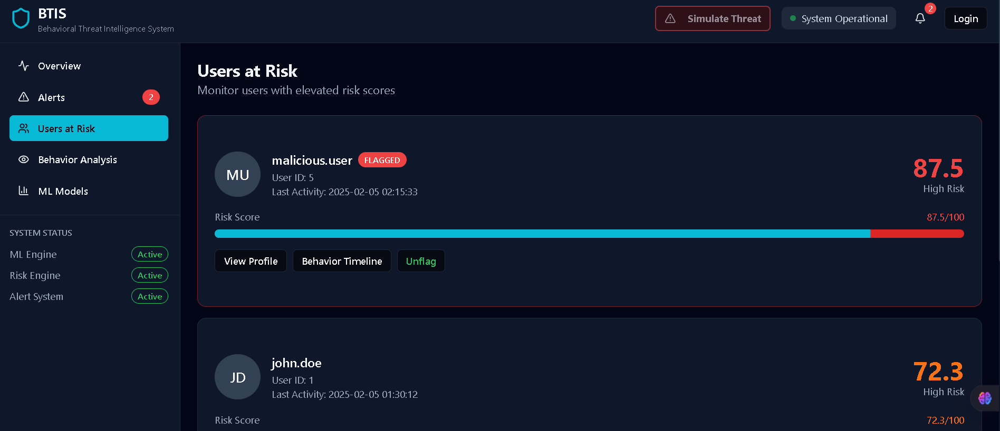
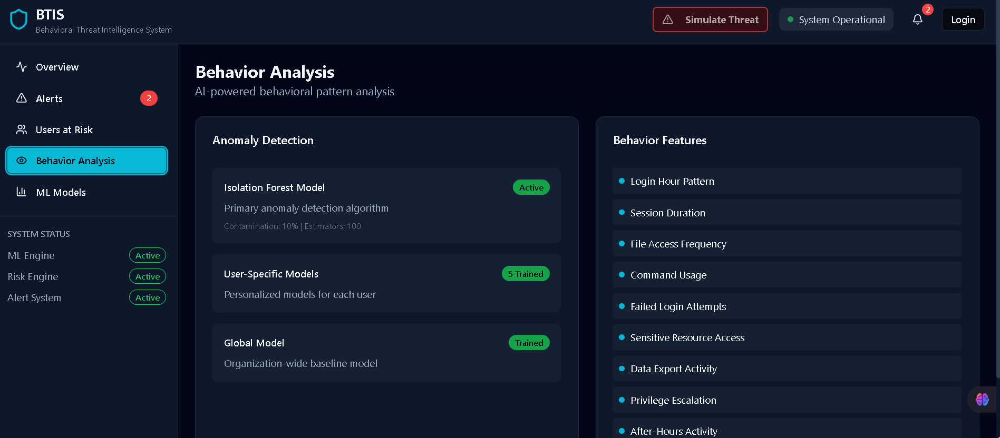
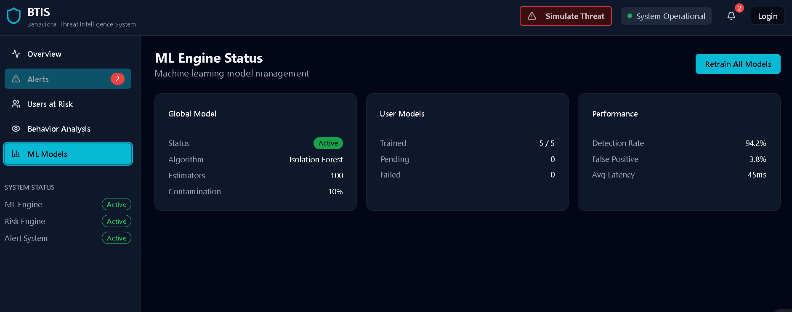
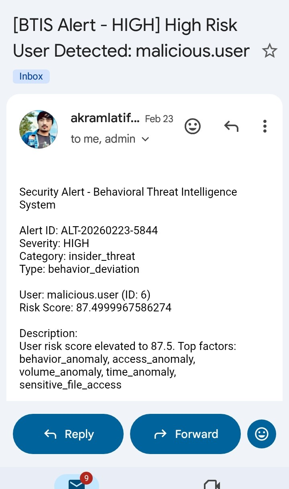

# AI-Driven BTIS Design

AI-Driven BTIS Design is an intelligent system that uses Artificial Intelligence techniques to assist in the design and development of a BTIS (Behavior-Threat Intelligence System). The goal of this project is to automate security monitoring, analyze behavioral patterns, and detect potential threats in a digital environment using machine learning and intelligent data processing.

The system integrates modern AI techniques with cybersecurity concepts to improve threat detection, decision making, and system monitoring.

---

## Project Overview

Cyber threats are increasing rapidly in modern network environments. Traditional security systems often fail to detect advanced threats or abnormal user behavior in real time.

AI-Driven BTIS Design focuses on building a smart security framework that can analyze network activities, identify suspicious behavior, and provide automated insights for administrators.

Artificial Intelligence and machine learning techniques are widely used in modern software engineering to automate complex tasks, improve prediction accuracy, and support intelligent decision making in software systems. ([ICCK][1])

This project demonstrates how AI techniques can be applied to enhance cybersecurity monitoring and threat detection systems.

---

## Key Features

* AI-based threat detection
* Behavioral analysis of system activities
* Intelligent monitoring of network events
* Real-time data processing
* Scalable security monitoring architecture
* Modular system design for future improvements

---

## System Architecture

The system is designed using a modular architecture where different components handle specific tasks such as:

* Data Collection
* Network Monitoring
* Feature Extraction
* AI-Based Threat Detection
* Alert Generation

Each module works together to provide a complete intelligent security monitoring system.

---

## Technologies Used

The project is developed using modern technologies including:

* Python
* Machine Learning
* Data Processing Techniques
* Network Monitoring Concepts
* AI-based Threat Analysis

---

## Project Structure

```
AI-Driven-BTIS-Design
│
├── backend
│   ├── api
│   ├── ml
│   ├── sniffer
│   └── main.py
│
├── src
│   ├── components
│   ├── sections
│   └── ui
│
├── assets
├── README.md
└── configuration files
```

---

## How to Run the Project

### 1. Clone the Repository

```
git clone https://github.com/akramlatif/AI-Driven-BTIS-Design.git
```

### 2. Navigate to the Project Folder

```
cd AI-Driven-BTIS-Design
```

### 3. Install Dependencies

```
pip install -r requirements.txt
```

### 4. Run the Application

```
python main.py
```

---

## Future Improvements

* Advanced AI threat detection models
* Real-time security dashboard
* Automated response system for detected threats
* Integration with cloud security platforms
* Improved visualization of network traffic

---

## Screenshots

### Dashboard Overview


### Security Alerts



### Users at Risk



### Behavior Analysis



### ML Models



### Email Alert - High Risk User Detected



---

## Author

Akram Latif
Cyber Security Student

---

## License

This project is developed for educational and research purposes.

[1]: https://www.icck.org/article/abs/jse.2025.407864?utm_source=chatgpt.com "Towards AI-Augmented Software Engineering: A Theoretical Framework"
